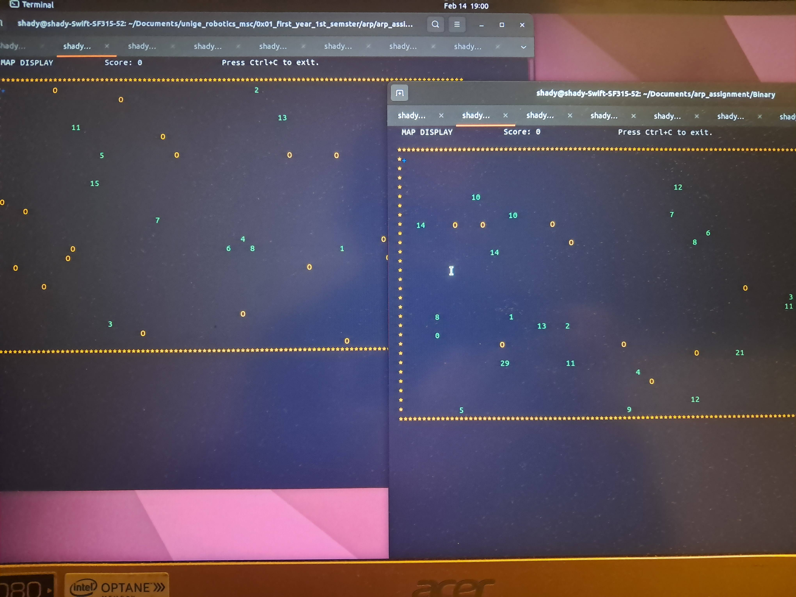

# ARP Assignment: Simultaneous Operation Across Two Machines with DDS

This project extends the first assignment by enabling simultaneous operation across two different machines. One machine will handle the generation of obstacles and targets, while the other will manage user input and the dynamics of the drone. Communication between the two machines is facilitated through the use of DDS (Data Distribution Service), employing a **publish/subscribe** model. This architecture allows for flexible, real-time coordination between the two systems, enabling efficient task distribution.

## Overview of DDS (Data Distribution Service)

DDS (Data Distribution Service) is a middleware protocol designed for real-time, scalable, and high-performance data exchanges. It is particularly suitable for systems that require low-latency communication and handling complex data types, such as sensor data or control commands.

In this project, DDS enables asynchronous communication between the two machines. One machine can publish data (obstacles or target positions), while the other subscribes to receive that data. This publish/subscribe model provides flexibility, allowing dynamic changes in roles while maintaining real-time coordination.

## DDS Nodes: Publisher and Subscriber

In the DDS system, communication is organized around a **Topic**. Both the publisher and subscriber must agree on the structure of the data in the topic.

### Publisher
- The Publisher sends data related to obstacles and target generators.

### Subscriber
- The Subscriber receives data from the Publisher.

Both Publisher and Subscriber communicate over a Topic, which defines the type of data being exchanged (e.g., the position of obstacles and targets).

## System Components

The system is divided into several key components, as outlined below:

- **Server**: Manages the overall coordination and communication between different components.
- **Input**: Handles user input for controlling the drone.
- **Drone Dynamics**: Simulates the drone’s behavior and responds to user inputs and environmental factors.
- **Watchdog**: Monitors system health and ensures proper operation of components.
- **Display**: Shows an interactive map of the evirovment.
- **Targets Generator**: Creates target points.
- **Targets Publisher**: Publishes the generated targets points to the other machine
- **Obstacles Subscriber**: Subscribes to a topic to get the generated obstacles' points from the other machine.


## How to Run the Project
To compile the project
```
chmod u+x make.sh
./make
```
To run the project
```
chmod u+x run.sh
./run.sh
```
You also need to run the other machine.
And don't forget to edit the IP and PORT in the sub and pub files.
## Results



